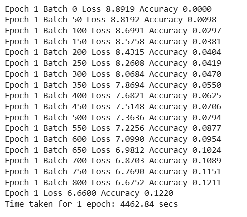
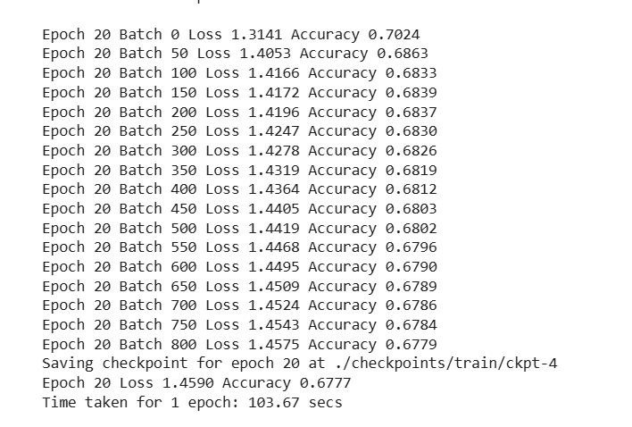

# Aluno: Yago Phellipe Matos Lopes
## Curso: Ciência da Computação

## Ponderada - Tradutor com Transformer

### Pontos Positivos e Negativos
#### **Pontos Positivos:**
- O código é didático e ajuda a entender a arquitetura Transformer, com foco no decoder e encoder.
- O uso de `tensorflow_datasets` facilitou o carregamento e a manipulação dos dados.
- A implementação com `Keras` ficou organizada com `Model` e `Layer`.

#### **Pontos Negativos:**
- **Desatualizações:** Precisei atualizar várias bibliotecas (`tensorflow`, `tensorflow-text`, `tensorflow-datasets`), além de corrigir erros de sintaxe.
- **Complexidade:** O `Encoder` e o `Decoder` feitos manualmente deixaram o código longo. Usar `tf.keras.layers.Transformer` seria mais simples.
- **Execução Lenta:** Sem GPU, o treinamento foi muito demorado.
- **Consumo de Memória:** O modelo exigiu muito hardware.

### Comparação CPU e GPU
#### **CPU**  
- **Épocas:** 1 época.
- **Tempo:** *4462,84 segundos (1h14min)*.
- **Acurácia:** *12,20%*.
- **Evolução por batch:** A acurácia subiu lentamente, começando em 0% e chegando a 12,2% após 800 batches.
- **Observações:** A CPU foi lenta demais, e 20 épocas levariam mais de *24 horas*.

#### **GPU (T4)**  
- **Épocas:** 20 épocas.
- **Tempo:** *2070,81 segundos (34,5min)*.
- **Acurácia:** *67,7%*.
- **Evolução por batch:** O ganho de acurácia foi muito mais rápido. Já no fim da 1ª época atingiu 12,2%, igual à CPU, mas em 34 minutos.
- **Observações:** A GPU acelerou o treinamento, com desempenho cerca de *10x* melhor que a CPU.

### **Conclusão:**
- A implementação foi trabalhosa devido a erros e atualizações.
- Sem GPU, o treinamento seria impraticável.
- Aprendi que, às vezes, usar funções prontas é mais eficiente.
- A prática trouxe insights valiosos sobre NLP e desempenho de hardware.

OBSERVAÇÃO: Adicionei os códigos treinamento com cpu e gpu na pasta códigos, para verificar a diferença nos logs caso o senhor queira.

